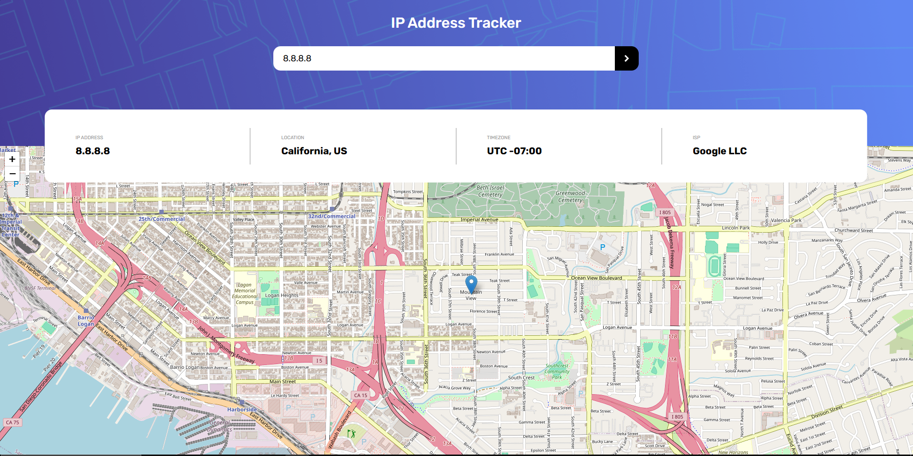

# Frontend Mentor - IP address tracker solution

This is a solution to the [IP address tracker challenge on Frontend Mentor](https://www.frontendmentor.io/challenges/ip-address-tracker-I8-0yYAH0). Frontend Mentor challenges help you improve your coding skills by building realistic projects. 

## Table of contents

- [Overview](#overview)
  - [The challenge](#the-challenge)
  - [Screenshot](#screenshot)
  - [Links](#links)
- [My process](#my-process)
  - [Built with](#built-with)
  - [What I learned](#what-i-learned)
  - [Continued development](#continued-development)
  - [Useful resources](#useful-resources)
- [Author](#author)
- [Acknowledgments](#acknowledgments)

## Overview

### The challenge

Users should be able to:

- View the optimal layout for each page depending on their device's screen size
- See hover states for all interactive elements on the page
- See their own IP address on the map on the initial page load
- Search for any IP addresses or domains and see the key information and location

### Screenshot

### Links

- Solution URL: [Add solution URL here](https://your-solution-url.com)
- Live Site URL: [Add live site URL here](https://your-live-site-url.com)

## My process

### Built with

- Semantic HTML5 markup
- CSS custom properties
- Flexbox
- Mobile-first workflow
- Vanilla JS
- [LeafletJS](https://leafletjs.com) - Open-Source JS library for Maps
- [IP Geolocation API](https://geo.ipify.org) - API for IP geolocation

### What I learned

This is the first project that I use an external JS library, in this case I used it for a map. I have to say that it was really cool and easy to use it. I think that reading library and API docs is a very good skill beacuse you learn how to use a tool in a really short amount of time.

### Continued development

I wanna keep practicing my JS skills, I think that I am getting good with JS but I still want to practice.

### Useful resources

- [Media Queries Breakpoints 2025](https://dev.to/gerryleonugroho/responsive-design-breakpoints-2025-playbook-53ih) - I always refer to this website but it is an incredible website with very useful information.
- [LeafletJS](https://leafletjs.com) - On the website there are docs with information about how to use it.
- [IP Geolocation API](https://geo.ipify.org) - Same as LeafletJS

## Author

- Frontend Mentor - [@SnakeZ115](https://www.frontendmentor.io/profile/SnakeZ115)

## Acknowledgments

I wanna give credit to [Dzhango](https://github.com/Dzhango/IP-address-tracker)'s solution. Thanks to it, I was able to optimize my code a little. That solution is a really good one, I recommend to check it out.

